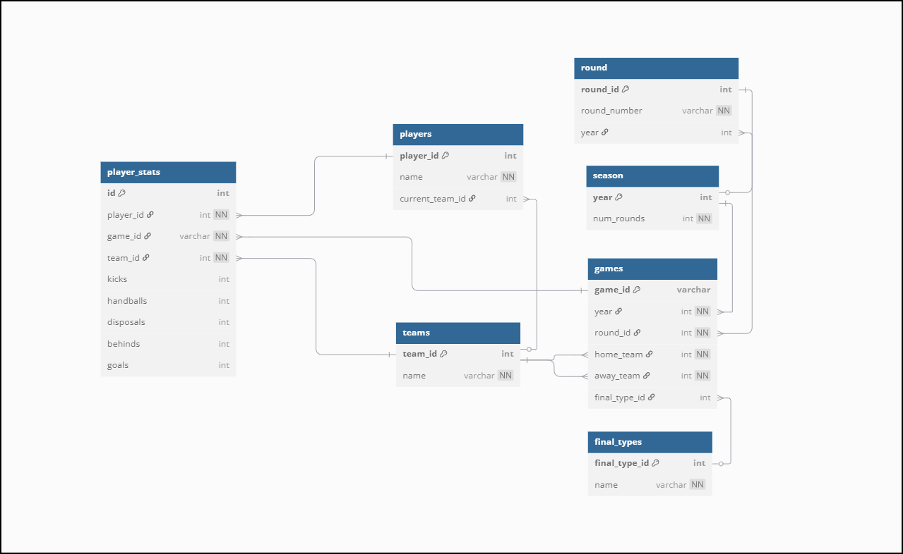

# AFL Stats Database

This project contains an SQLite database schema and tools for managing AFL Statistics.
It includes class entities relevant to AFL, including teams, players and games.

## Database Structure

Below is a visualisation of the current basic database structure:

## Setup